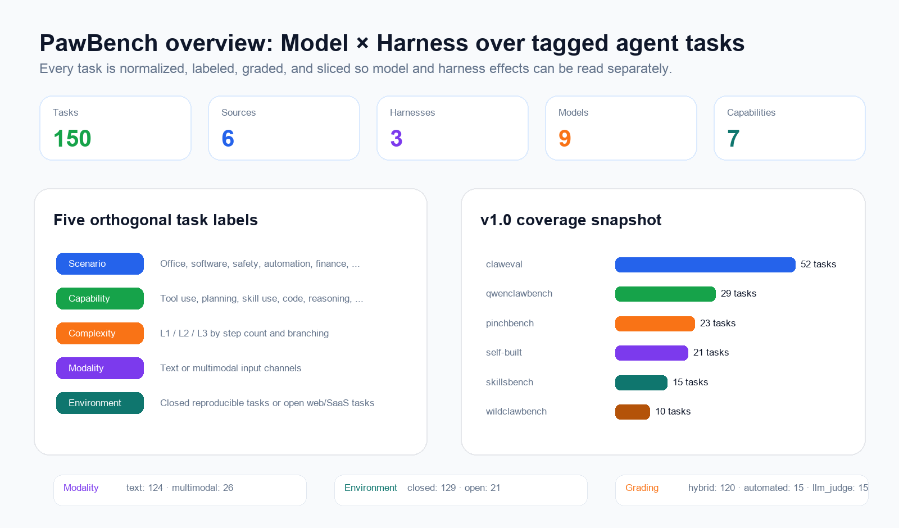
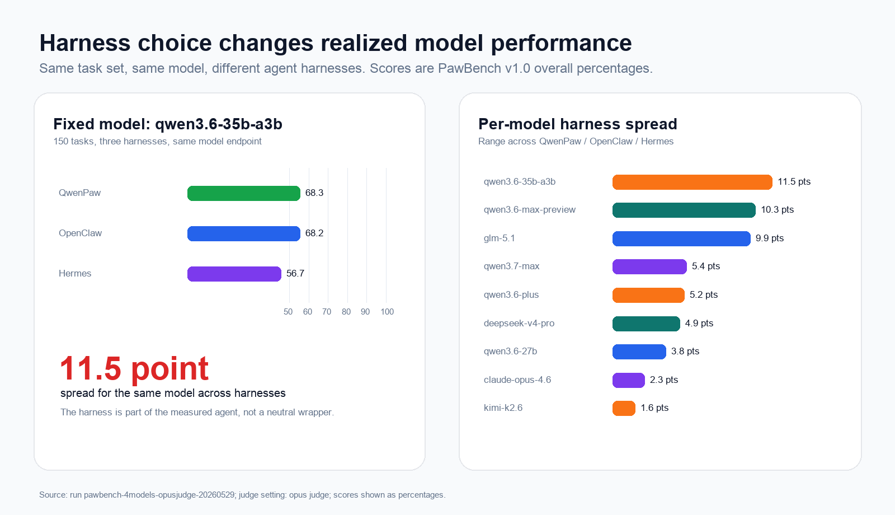
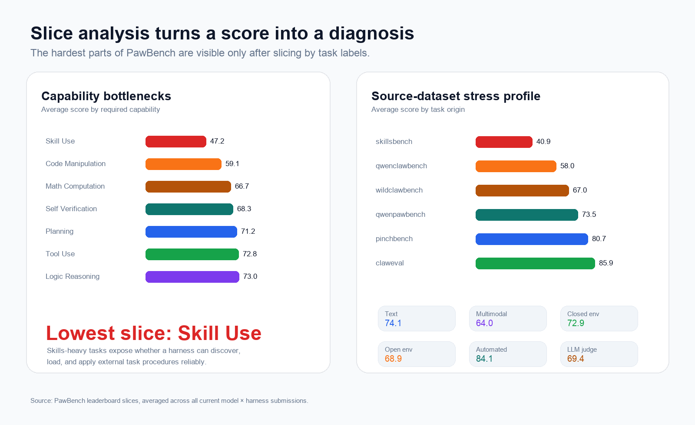

<h1 align="center">🐾 PawBench</h1>

<p align="center">
  <a href="README.md"><strong>English</strong></a> ·
  <a href="README.zh-CN.md">简体中文</a>
</p>

<p align="center">
  <a href="#tasks">
    
  </a>
  <a href="https://agentscope-ai.github.io/PawBench/">
    
  </a>
  <a href="#harnesses">
    
  </a>
  <a href="https://agentscope-ai.github.io/PawBench/">
    
  </a>
  <a href="https://github.com/agentscope-ai/OpenJudge">
    
  </a>
  <a href="LICENSE">
    
  </a>
</p>

<p align="center">
  <strong>A Model × Harness co-evaluation benchmark for agentic AI.</strong><br>
  150 agent tasks · 9 models · 3 harnesses · task slices · diagnostic traces
</p>

---

The same model can behave very differently once it is placed inside a real agent runtime. A failure may come from model reasoning, missing tools, weak skill discovery, poor workspace awareness, brittle web access, or a completion check that is too loose. A single final pass rate cannot separate these causes.

PawBench is built around one claim:

$$\text{Agent Performance} = f(\text{Model}, \text{Harness})$$

> [!NOTE]
> PawBench is part of the [OpenJudge](https://github.com/agentscope-ai/OpenJudge) ecosystem. It shares OpenJudge's philosophy of evaluation-driven optimization, but focuses specifically on the interaction between LLMs and agent harnesses.

It evaluates **the model and the harness together** while keeping enough metadata to read both dimensions independently. v1.0 covers **9 models × 3 harnesses × 150 tasks**, with public prompts, graders, task labels, submissions, and leaderboard slices.



With PawBench, you can:

- **Select models & harnesses** for text, multimodal, skill-heavy, and web-search workloads.
- **Diagnose** whether a regression comes from the model, the harness, or the grader.
- **Iterate** on a harness change, rerun the same task slice, and check whether the targeted score actually moves.
- **Contribute** new harnesses, tasks, graders, submissions, and bug fixes back into a shared evaluation loop.

## Core Findings

The initial PawBench v1.0 runs show that harness design is not a minor implementation detail. It can change the realized capability of the same model by a margin comparable to many model upgrades.

Unless otherwise noted, the numbers below come from this evaluation setting: **150 PawBench v1.0 tasks**, **9 models**, **3 harnesses** (`qwenpaw`, `openclaw`, `hermes`), and **claude opus 4.6 as judge**. Scores are reported as overall percentages.



- **Harness gaps are visible even when the model is fixed.** With the same `qwen3.6-35b-a3b` model on the same 150 tasks, QwenPaw scores **68.3**, OpenClaw **68.2**, and Hermes **56.7**, leaving an **11.5-point** spread. This is not isolated to one model: `qwen3.6-max-preview` has a **10.3-point** harness spread, `glm-5.1` has a **9.9-point** spread, and six of the nine tested models move by more than three points across harnesses.
- **Average performance differs across harnesses.** Averaged across the 27 model × harness submissions in this run, QwenPaw scores **74.9**, OpenClaw **72.9**, and Hermes **69.3**. The overall leaderboard is only the first view; slice analysis is what shows which harness is brittle on which capability, source, scenario, or modality.



Slice numbers below are macro-averages across the same 27 model × harness submissions. They point to several high-value improvement areas:

- **Skill-heavy tasks are the hardest.** `Skill_Use` averages **47.2**, and `skillsbench` tasks average **40.9**, suggesting that skill discovery, skill loading, and procedural execution are still fragile.
- **Multimodal tasks remain harder than text.** Text-only tasks average **74.1**, while multimodal tasks average **64.0**.
- **Open environments add real friction.** Closed, reproducible tasks average **72.9**; open-environment tasks average **68.9**.
- **Some domains expose much larger harness differences than the overall score.** Finance, information retrieval, manufacturing quality control, and software-engineering slices are useful targets for harness debugging.

See the [live leaderboard](https://agentscope-ai.github.io/PawBench/) for the full Model × Harness matrix and all slice views.

## Evaluation Workflows

PawBench is intended to be used as a diagnostic benchmark, not just a ranking table.

| Goal | Recommended setup | What to inspect |
| :--- | :--- | :--- |
| Choose a model | Fix one harness, run multiple models | Overall score, text/multimodal split, cost and trace quality |
| Choose a harness | Fix one model, run multiple harnesses | Harness gap, task errors, tool-use traces, workspace artifacts |
| Debug a harness | Rerun targeted slices after a change | Capability/source/scenario deltas, failed graders, transcripts |
| Add a dataset | Add tasks with the five-label taxonomy | Coverage balance, grader reliability, task detail page |
| Submit results | Aggregate run logs into `submissions/*.json` | Leaderboard row, slice payloads, task error count |

> **💡 Optimize Your Evaluation Logic with OpenJudge**
> To build your own evaluation system beyond the LLM × Harness vertical, you can leverage **[OpenJudge](https://github.com/agentscope-ai/OpenJudge)**'s 50+ production-ready graders (relevance, tool selection, trajectory, etc.) to evaluate and optimize your custom agents.

## Quick Start

### Requirements

Python 3.11+ and Docker are required. Node.js 20+ is only needed for the leaderboard site.

Install dependencies and add credentials. DashScope is the recommended provider for the default setup:

```bash
pip install -r requirements.txt

cat > .env <<'EOF'
DASHSCOPE_API_KEY=...
JUDGE_API_KEY=...
JUDGE_BASE_URL=...
EOF
```

For OpenAI-compatible or custom providers, set `OPENAI_API_KEY` / `OPENAI_BASE_URL` or `CUSTOM_API_KEY` / `CUSTOM_BASE_URL` as needed.

### Run Evaluation

All agent harnesses run through the **Harbor Bridge** inside a single base image. Every agent (QwenPaw, OpenClaw, Hermes, Claude Code, Codex, Aider, …) is a [Harbor](https://github.com/av/harbor)-compatible `BaseInstalledAgent` executed inside `pawbench-base:latest`.

Before the first run, build the base image (includes `harbor-framework` and all system dependencies):

```bash
docker build -f docker/Dockerfile.pawbench-base -t pawbench-base:latest .
```

> **Note — harbor-v2 tasks may depend on this image too.** Some
> `data_v2.1`/`data_v2.2` task `environment/Dockerfile`s `FROM
> pawbench-base:latest` (instead of the internal registry image) so the task
> container comes with every Harbor agent CLI pre-baked (including `claude`).
> That lets Harbor's `install()` skip re-installing the agent-under-test's CLI
> when it's already present, and keeps OpenJudge's `claude-code` judge
> harness available even when the agent-under-test isn't Claude Code.
> **`pawbench-base:latest` is currently only built locally and never pushed to
> a registry** — if you see "pull access denied" or "image not found" for one
> of these tasks on a fresh machine/CI, it just means this base image hasn't
> been built there yet; run the `docker build` command above first.

> **Note — vendored Harbor fixes.** The `harbor/` tree is vendored and
> git-ignored, so two required agent fixes — qwenpaw provider routing (relay
> endpoints must not use the builtin `openai` provider) and the hermes session
> export (`--source cli` is broken) — ship as a patch in
> `patches/harbor-agent-fixes.patch`. The Docker build applies it automatically
> (idempotently). If you also run agents from the host (e.g. a conda env with
> `pip install -e ./harbor`), apply it once with:
>
> ```bash
> scripts/apply-harbor-patches.sh   # idempotent; safe to re-run
> ```

```bash
# Smoke test: run one PawBench v1.0 task with the default agent (harbor:qwenpaw)
python run_bench.py --tasks T053 --model dashscope/qwen3.6-plus

# Pick a different harness (the harbor: prefix is optional; qwenpaw == harbor:qwenpaw)
python run_bench.py --agents harbor:openclaw --tasks T053 --model dashscope/qwen3.6-plus

# Compare harnesses on a task subset
python run_bench.py \
  --agents harbor:qwenpaw harbor:openclaw harbor:hermes \
  --model dashscope/qwen3.6-plus \
  --tasks T002 T006

# Sequentially evaluate multiple models
python run_bench.py \
  --model dashscope/qwen3.6-plus \
  --model anthropic/claude-sonnet-4-6
```

See `python run_bench.py --help` for all flags, including `--no-results-version-path`, `--save-workspace`, and `--save-docker-image`.

### Native / Single / Forced / Adaptive Agent Modes

PawBench provides four execution modes:

- `native`: preserve the harness's own configuration without injecting any
  PawBench multi-agent override (default when the option is omitted).
- `single`: explicitly disable native sub-agent delegation.
- `adaptive`: expose delegation tools and let the main agent decide whether to delegate.
- `forced`: require at least one real sub-agent delegation. If the trace contains no
  Claude Code `Task`, Codex `spawn_agent`, OpenClaw `sessions_spawn`, or QwenPaw
  `spawn_subagent` call, the task is recorded with `score=0` and `passed=false`.

```bash
# Harness-native defaults (also selected when the option is omitted)
python run_bench.py --agents harbor:openclaw --multi-agent-mode native ...

# Strict single agent
python run_bench.py --agents harbor:openclaw --multi-agent-mode single ...

# Adaptive multi-agent
python run_bench.py --agents harbor:openclaw --multi-agent-mode adaptive ...

# Forced multi-agent
python run_bench.py --agents harbor:codex --multi-agent-mode forced ...
```

Native multi-agent support currently covers `claude-code`, `codex`, `openclaw`, and
QwenPaw 2.0.0.post3+ (`qwenpaw`). Requests for `forced` or `adaptive` on other
harnesses such as `hermes` emit a warning and fall back to `single`. Result JSON
records requested/effective modes, delegation counts, and forced-mode violations
under `run_config.multi_agent` and each result's `multi_agent` field.

Legacy values remain compatible: `disabled→single`, `auto/subagents→adaptive`, and
`teams/delegation/proactive→forced`. The legacy `--multi-agent` flag by itself is
equivalent to `--multi-agent-mode adaptive`.

#### Evaluating with other Harbor Bridge Agents (Claude Code, Codex, and more)

The same Harbor Bridge lets you benchmark Claude Code, OpenAI Codex CLI, Aider, and many other coding agents on the same 150 PawBench tasks — no extra image build required.

**1. Set your API keys** in `.env` (copy from `.env.example` if you haven't already):

```bash
# For Claude Code
ANTHROPIC_API_KEY=sk-ant-...

# For Codex CLI
OPENAI_API_KEY=sk-...
```

**2. Run with the `harbor:` prefix** in `--agents`:

```bash
# Evaluate Claude Code (claude-opus-4-5 or any Anthropic model)
python run_bench.py \
  --agents harbor:claude-code \
  --model anthropic/claude-opus-4-5 \
  --tasks T053

# Evaluate OpenAI Codex CLI
python run_bench.py \
  --agents harbor:codex \
  --model openai/codex-mini \
  --tasks T053

# Side-by-side comparison: Claude Code vs Codex vs QwenPaw on the same tasks
python run_bench.py \
  --agents harbor:claude-code harbor:codex harbor:qwenpaw \
  --model anthropic/claude-opus-4-5 \
  --tasks T002 T006 T053
```

**Supported Harbor agents** (use any as `harbor:<name>`):

| Name | Agent |
| :--- | :--- |
| `qwenpaw` | QwenPaw (default) |
| `openclaw` | OpenClaw |
| `hermes` | Hermes |
| `claude-code` | Anthropic Claude Code CLI |
| `codex` | OpenAI Codex CLI |
| `aider` | Aider (Paul Gauthier) |
| `gemini-cli` | Google Gemini CLI |
| `qwen-code` | Qwen Code CLI |
| `goose` | Block Goose |
| `opencode` | OpenCode |
| `openhands` | OpenHands (All-Hands-AI) |
| `swe-agent` | SWE-agent (Princeton NLP) |
| `cursor-cli` | Cursor CLI |
| `kimi-cli` | Kimi CLI |
| `copilot-cli` | GitHub Copilot CLI |

### View the Leaderboard

The website exposes the Model × Harness matrix, sortable leaderboard, slice analyzer, task library, and per-task pages.

```bash
cd site
npm install
npm run build:data    # aggregate raw run logs into submissions/ and JSON for the UI
npm run dev           # http://localhost:4321/PawBench/
```

For submission formats and site data generation details, see [site/README.md](site/README.md).

## PawBench Design

### Tasks

PawBench follows a **Reuse & Tag** methodology. Instead of writing every task from scratch, it pulls tasks from established agent benchmark suites, normalizes them into one format, and tags each task across five orthogonal dimensions.

| Dimension | Field | Values |
| :--- | :--- | :--- |
| Scenario | `scenario` | L1 categories such as `Office_Productivity`, `Software_Engineering`, `Safety_Alignment` |
| Capability | `capabilities` | `Logic_Reasoning`, `Math_Computation`, `Code_Manipulation`, `Tool_Use`, `Skill_Use`, `Planning`, `Self_Verification` |
| Complexity | `complexity` | `L1` (1-2 steps), `L2` (3-5 steps), `L3` (>5 steps with branches or backtracking) |
| Modality | `modality` | `text` or `multimodal` (`image`, `audio`, `video`) |
| Environment | `environment` | `closed` (offline, reproducible) or `open` (live internet / SaaS APIs) |

v1.0 contains **150 tasks** from `claweval`, `qwenclawbench`, `pinchbench`, PawBench self-built tasks, `skillsbench`, and `wildclawbench`.

| Source                                                           | # | Main coverage |
|:-----------------------------------------------------------------| ---: | :--- |
| `self-built`                                                     | 21 | Self-built tasks covering automation, information retrieval, and safety alignment |
| [`claweval`](https://github.com/claw-eval/claw-eval)             | 52 | Office productivity, data analytics, content creation |
| [`qwenclawbench`](https://github.com/SKYLENAGE-AI/QwenClawBench) | 29 | Automation, software engineering, safety alignment |
| [`pinchbench`](https://github.com/pinchbench/skill)              | 23 | Office workflows, software engineering, information retrieval |
| [`skillsbench`](https://github.com/benchflow-ai/skillsbench)     | 15 | Long-horizon skills, domain automation |
| [`wildclawbench`](https://github.com/InternLM/WildClawBench)     | 10 | Office workflows, safety alignment |

Each task page on the site shows its prompt, expected behavior, grading criteria, automated checker code, LLM judge rubric, workspace files, and metadata.

### Harnesses

PawBench supports two kinds of harnesses: **built-in harnesses** that ship with PawBench, and **Harbor Bridge agents** that wrap any [Harbor](https://github.com/av/harbor)-compatible coding agent.

**Built-in harnesses**

| Harness | Link | Current role |
| :--- | :--- | :--- |
| QwenPaw | [agentscope-ai/QwenPaw](https://github.com/agentscope-ai/QwenPaw) | Default PawBench harness and primary baseline |
| OpenClaw | [openclaw/openclaw](https://github.com/openclaw/openclaw) | General-purpose open agent runtime |
| Hermes | [NousResearch/hermes-agent](https://github.com/NousResearch/hermes-agent) | Alternative community agent harness |

**Harbor Bridge agents** (use `--agents harbor:<name>`)

Harbor Bridge connects PawBench to the broader [Harbor](https://github.com/av/harbor) ecosystem. It translates Harbor's `exec()` / `upload_file()` interface into `docker exec` / `docker cp` calls against the running PawBench container, so any Harbor-compatible agent can be benchmarked without modification. Requires building `docker/Dockerfile.pawbench-base` first.

| Name | Agent | Provider |
| :--- | :--- | :--- |
| `harbor:claude-code` | Claude Code CLI | Anthropic |
| `harbor:codex` | Codex CLI | OpenAI |
| `harbor:aider` | Aider | Paul Gauthier |
| `harbor:gemini-cli` | Gemini CLI | Google |
| `harbor:qwen-code` | Qwen Code CLI | Alibaba |
| `harbor:goose` | Goose | Block |
| `harbor:opencode` | OpenCode | — |
| `harbor:openhands` | OpenHands | All-Hands-AI |
| `harbor:swe-agent` | SWE-agent | Princeton NLP |
| `harbor:cursor-cli` | Cursor CLI | Anysphere |
| `harbor:kimi-cli` | Kimi CLI | Moonshot AI |
| `harbor:copilot-cli` | GitHub Copilot CLI | GitHub |

Harnesses are treated as first-class benchmark subjects. A harness contribution should preserve the same task prompt, workspace contract, timeout behavior, transcript format, and result schema so model and harness effects remain comparable.

### Grading

Each task declares one of three grading modes:

- `automated`: task-specific checks and assertions.
- `llm_judge`: LLM-as-judge for semantic outputs.
- `hybrid`: automated checks plus LLM judgment.

Runs can be sliced by source, scenario, capability, complexity, modality, environment, grading type, model, and harness. PawBench also stores transcripts and metrics for each task. With `--save-workspace` and `--save-docker-image`, it can preserve the agent workspace and final Docker image for deeper replay.

## Roadmap

- [x] **Harness coverage:** Claude Code, Codex CLI, Aider, Gemini CLI, Cursor CLI, and 10+ more agents via Harbor Bridge (`--agents harbor:<name>`).
- [ ] **Harness coverage:** add CoPaw and additional community scaffolds.
- [ ] **Dataset expansion:** add more open-environment, multimodal, skill-heavy, long-horizon, and real-world SaaS/API tasks.
- [ ] **Controlled studies:** turn the current findings into experiments around tool count, workspace awareness, skill discovery, web tools, and artifact-level completion checks.
- [ ] **Diagnostics:** improve trace replay, workspace diffs, failure attribution, and slice-level regression reports.
- [ ] **Evaluation reliability:** calibrate LLM judge prompts, strengthen automated graders, and document known failure modes.

## Contributing

We welcome contributions that make PawBench a better shared testbed for Model × Harness evaluation.

| Contribution | What to add |
| :--- | :--- |
| New harness | Agent adapter, Dockerfile if needed, environment setup, transcript capture, result normalization |
| New tasks | Task markdown, workspace assets, five-label taxonomy, automated checks and/or LLM judge rubric |
| New results | Raw run logs or `submissions/*.json` with overall and slice scores |
| Grader fixes | More deterministic checks, clearer rubrics, bug fixes for false positives/false negatives |
| Site improvements | Better leaderboard views, slice analysis, task explorer, trace replay, and documentation |

Good first contributions include adding missing task labels, improving task rubrics, reproducing a failed slice, integrating a new harness behind `--agents`, or submitting evaluation results for an untested model × harness pair.

## Citation

If you use PawBench in your research or project, please cite it as:

```bibtex
@misc{pawbench,
  title  = {PawBench: A benchmark for evaluating LLM × harness performance},
  author = {The OpenJudge Team},
  url    = {https://github.com/agentscope-ai/PawBench},
  month  = {06},
  year   = {2026}
}
```

## Acknowledgments

PawBench is built on top of the open-source agent evaluation community, including [Claw-Eval](https://github.com/claw-eval/claw-eval), [QwenClawBench](https://github.com/SKYLENAGE-AI/QwenClawBench), [WildClawBench](https://github.com/InternLM/WildClawBench), [PinchBench](https://github.com/pinchbench/skill), [skillsbench](https://github.com/benchflow-ai/skillsbench), and others.
