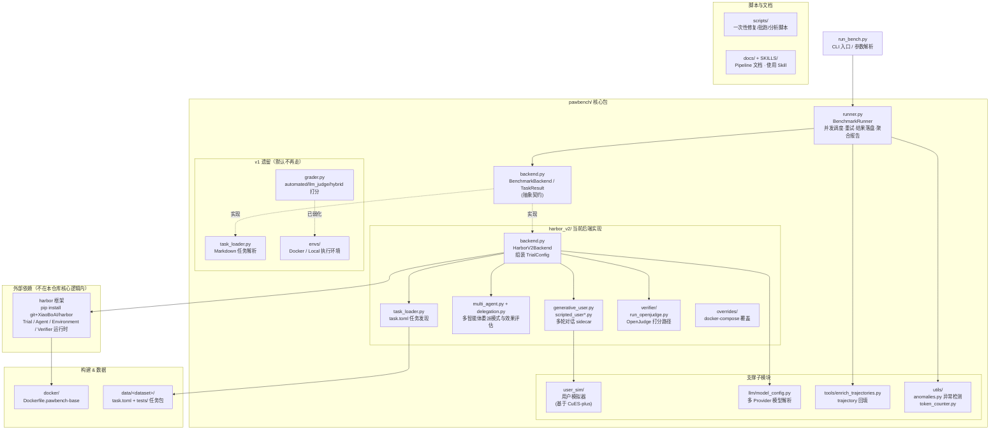

# PawBench 评测 Pipeline 介绍

本文档介绍 PawBench（`harbor-v2` 后端）从一条 `run_bench.py` 命令到最终结果 JSON
的完整执行链路：任务如何被发现、agent 如何在容器里跑、结果如何被打分、以及结果
最终落到哪里。适合想理解或魔改评测流程内部机制的人阅读；只是想跑评测的话看
[`SKILLS/pawbench-run-eval/SKILL.md`](../SKILLS/pawbench-run-eval/SKILL.md) 就够了。

## 代码结构与模块划分

仓库代码可以分成 7 个模块：CLI 入口、`pawbench` 核心包（内部再拆 5 块）、Harbor
外部框架、Docker 构建、数据集、一次性脚本、文档/Skills。



| 模块 | 路径 | 职责 |
|---|---|---|
| CLI 入口 | `run_bench.py` | 解析参数，组装 `agent_config`，按 `模型 × agent` 矩阵依次调用 `BenchmarkRunner` |
| 核心契约 | `pawbench/backend.py` | 定义 `BenchmarkBackend` 抽象接口和 `TaskResult` 数据类，所有后端都要实现它 |
| 调度器 | `pawbench/runner.py` | `BenchmarkRunner`：并发/重试控制、异常检测、结果落盘（`summary/`+`trials/`）、跨进程聚合 `combined_report.json` |
| 当前后端 | `pawbench/harbor_v2/` | 唯一实际生效的后端（`run_bench.py::_select_backend` 现在只返回它）。内部再分 5 块：任务发现（`task_loader.py`）、Trial 组装与结果映射（`backend.py`）、多智能体委派（`multi_agent.py`/`delegation.py`）、多轮对话 sidecar（`generative_user.py`/`scripted_user*.py`）、打分（`verifier/`，含 OpenJudge 路径） |
| v1 遗留 | `pawbench/task_loader.py`、`grader.py`、`envs/` | 早期基于 Markdown + YAML front-matter 的任务格式和三种打分方式（automated/llm_judge/hybrid），代码仍保留但当前 CLI 路径已不再选中它 |
| 支撑子模块 | `pawbench/user_sim/`、`llm/`、`tools/`、`utils/` | 用户模拟器（复用 `examples/CuES-plus`）、多 Provider 模型 ID 解析、trajectory 回填、异常检测规则 |
| 外部依赖 | `harbor`（pip 从 `XiaoBoAI/harbor` git 安装） | 真正执行 Trial 的框架：起容器、跑 agent CLI、起独立 verifier 容器打分。不属于本仓库代码，只在 `docker/Dockerfile.pawbench-base` 里声明版本 |
| 构建 & 数据 | `docker/`、`data/<dataset>/` | Docker 基础镜像定义；按 `task_id/task.toml+tests/` 组织的任务包数据集 |
| 脚本与文档 | `scripts/`、`docs/`、`SKILLS/` | 一次性修复/批跑/分析脚本（不进评测主流程）；架构文档与 Cursor Skill |

几个容易困惑的点：
- 仓库里还有 `harbor/`、`harbor-github/` 两个目录，是历史遗留的本地 harbor 源码克隆，
  现已改成 Dockerfile 里 `pip install git+...` 直接装，两者都已在 `.dockerignore` /
  构建流程之外，不算当前架构的一部分。
- `pawbench/task_loader.py` + `grader.py` + `envs/` 是 v1.0（Markdown 任务）时代的
  产物，`run_bench.py::_select_backend()` 目前硬编码只返回 `HarborV2Backend`，这条
  legacy 路径代码还在但不会被跑到。

## 整体架构

```
run_bench.py
  │  解析 CLI 参数 → 组装 agent_config（model/api_key/judge/multi_agent/...）
  ▼
BenchmarkRunner.run()                         pawbench/runner.py
  │  1. backend.load_tasks()  发现本次要跑的 task 列表
  │  2. 按 --concurrency 并发调度，每个 task 跑 --runs 次，失败按 --max-retries 重试
  │  3. 每次跑完：异常检测 → 落盘 summary/ bundle → 更新 combined_report.json
  ▼
HarborV2Backend.run_and_grade()               pawbench/harbor_v2/backend.py
  │  1. 按 task.toml 描述组装 Harbor TrialConfig（agent/environment/verifier）
  │  2. 若是多轮对话 task：materialize user-sim sidecar（generative/scripted）
  │  3. 若走 OpenJudge：materialize 定制 verifier 到任务包里
  │  4. await Trial.create(config).run()   ← 实际执行/打分都在这一步
  │  5. 把 TrialResult 映射成 pawbench 的 TaskResult（score/transcript/usage/...)
  ▼
harbor.trial.Trial（Harbor 框架，pip 安装的 harbor 包）
  │  1. 用 environment/Dockerfile 起任务容器
  │  2. agent.install() + agent.run(instruction)  ← agent CLI 在容器里跑
  │  3. 起独立的 verifier 容器，跑 tests/test.sh 打分
  ▼
TaskResult（每个 task 一份） ──▶ results/<ts>/<task_id>/<model>/<agent>/{summary,trials}/
                            └─▶ <ts>_combined_report.json（本次 run 全量聚合)
```

## 1. 任务发现：任务包长什么样

`HarborV2Loader`（`pawbench/harbor_v2/task_loader.py`）扫描
`<benchmark_path>/data/<dataset>/` 下的每个任务目录：

```
<task_id>/
├── task.toml               # Harbor TaskConfig：metadata/agent/environment/verifier 配置
├── instruction.md          # 喂给 agent 的任务 prompt
├── environment/Dockerfile  # 这个 task 专属的运行环境镜像
├── solution/solve.sh       # 参考解法（可选）
└── tests/
    ├── test.sh              # 跑 `uvx harbor-rewardkit /tests`
    ├── reward.toml          # 打分聚合规则（如 weighted_mean + threshold）
    ├── structure/           # 第一阶段：结构性检查（文件存在/格式对不对）
    └── quality/             # 第二阶段：LLM-judge 语义检查，或 OpenJudge agentic grader
```

`--tasks` 过滤时用的就是这个目录名（如 `ma-betweenness-01`），不是 v1.0 遗留数据集
里的 `T0xx` 编号。`task.toml` 的 `[metadata]` 字段会被映射成 `frontmatter`，供后续
按 scenario/capability/complexity/modality/environment 五维标签做切片统计。

## 2. Agent 执行：Harbor Trial

`run_and_grade()` 把一个 `HarborV2Task` + `agent_config` 组装成 Harbor 的
`TrialConfig`，交给 `harbor.trial.Trial` 执行，关键决策点：

- **Agent 选择**：`--agents harbor:<name>` 里的 `<name>` 先查
  `_AGENT_NAME_ALIASES`（如 `qwen-code → qwen-coder`），再查
  `_AGENT_IMPORT_PATHS`（`claude-code`/`hermes`/`qwenpaw` 不在 Harbor 的
  `AgentName` 枚举里，要用 `module:Class` 形式绕过枚举校验）。
- **环境变量注入**：`_build_agent_env()` 按 harness 的 provider 约定
  （`ANTHROPIC_API_KEY`/`OPENAI_API_KEY`/`DASHSCOPE_*`...）把 `--model`/
  `--api-key`/`--base-url` 转成 agent 容器能读到的环境变量；`_build_verifier_env()`
  同理给 verifier 容器注入 judge 相关的 key/base-url。
- **工作区路径**：agent 的产出目录固定是 `/home/node/workspace`
  （`agent_workspace_path`），多轮对话 sidecar、`--save-workspace` 收集、
  verifier 读取产出都基于这个统一路径，避免路径不一致导致产出"消失"。
- **超时**：`--timeout-multiplier` 整体缩放；个别 harness（QwenPaw/Hermes）因为
  安装阶段本身较慢，有单独放宽的 `override_setup_timeout_sec`。

`Trial.run()` 内部会：起任务容器 → `agent.install()`（装 CLI，命中镜像预装则跳过）
→ `agent.run(instruction)`（真正执行任务）→ 收集 ATIF 格式的 trajectory → 起独立
verifier 容器跑 `tests/test.sh` → 把 reward 写回 `TrialResult`。

## 3. 多轮对话任务（user-sim sidecar）

`task.toml` 里 `[metadata].mode` 声明为多轮对话（`ua-mt-*`/`ua-cw-*` 一类 task）时，
`HarborV2Backend` 会在跑之前把任务包"物化"（materialize）成带一个额外 user-sim
sidecar 容器的版本：

- **generative**（`generative_user.py`）：sidecar 跑一个真实 LLM 扮演"用户"，按
  `USER_SIM_MODEL`/`USER_SIM_API_KEY`/`USER_SIM_BASE_URL` 配置的模型即时生成回复。
- **scripted**（`scripted_user.py`）：sidecar 按预先写好的对话脚本回复，不调用
  LLM，用于需要严格可复现对话流程的 task。

Agent 通过 MCP 工具（`start_conversation`/`send_message_to_user`，具体工具名因
harness 而异）与 sidecar 交互。跑完后 `_enrich_trajectory_file()`
（`pawbench/tools/enrich_trajectories.py`）会把 sidecar 侧持久化的对话记录解码、
按时间顺序插回 `agent/trajectory.json`，让最终 trajectory 里能看到完整的
agent↔user 对话，不用再去交叉对照 `user_sim_state.json`。

## 4. 多智能体委派（multi-agent modes）

`--multi-agent-mode` 控制主 agent 能不能/要不要把子任务委派给 sub-agent，四种模式
（`pawbench/harbor_v2/multi_agent.py`）：

| 模式 | 行为 |
|---|---|
| `native`（默认） | 不做任何 PawBench 侧的覆盖，完全用 harness 自己的原生配置 |
| `single` | 强制关闭委派 |
| `adaptive` | 把委派工具暴露给主 agent，让它自己决定要不要委派 |
| `forced` | 要求至少发生一次真实委派（Claude Code `Task`、Codex `spawn_agent`、
  OpenClaw `sessions_spawn`、QwenPaw `spawn_subagent`），trace 里没有对应调用则
  `score=0, passed=false` |

只有 `claude-code`/`codex`/`openclaw`/`qwenpaw`（2.0.0.post3+）原生支持委派；其它
harness 请求 `forced`/`adaptive` 会被 `resolve_for_harness()` 降级为 `single` 并打
warning。跑完后 `delegation.py::evaluate_multi_agent_run()` 从 trajectory 里统计
实际委派次数、深度、`forced` 模式是否违规，写进 `TaskResult.multi_agent` 字段。

## 5. 打分：两套 verifier 框架

`tests/test.sh` 跑 `uvx harbor-rewardkit /tests`，具体走哪条打分路径由
`tests/quality/agent_judge.toml` 的 `framework` 字段决定：

- **RewardKit（默认）**：两阶段——`tests/structure/` 先做结构性检查（产出文件是否
  存在、格式对不对），再跑 `tests/quality/` 做 LLM-judge 语义检查。两者按
  `tests/reward.toml` 声明的权重（如 `weighted_mean`）聚合成 `score`，再用
  `threshold` 转成二元 `reward`（pass/fail）。
- **OpenJudge**（`framework = "openjudge"`）：`run_openjudge.py`
  （`pawbench/harbor_v2/verifier/`）跑 OpenJudge 的 `AgenticGrader`，用
  `ClaudeCodeHarness`/`CodexHarness`/`CursorAgentHarness` 之一作为"判官 agent"
  重新审视 workspace + trajectory 打分。细节见
  [`OPENJUDGE_PIPELINE.md`](../pawbench/harbor_v2/verifier/OPENJUDGE_PIPELINE.md)。
  这条路径需要 `JUDGE_API_KEY`/`JUDGE_BASE_URL`，判官模型默认走 `claude-code` 判官
  harness（所以 `pawbench-base` 镜像即使被测 agent 不是 Claude Code，也预装了
  `claude` CLI）。

两条路径最终都写 `verifier/reward.json`（`{quality, structure/result, score, reward,
valid}`），`HarborV2Backend._apply_reward_spec()` 读它填 `TaskResult.score` /
`TaskResult.passed`（`passed = reward["reward"] >= 1.0`）。

## 6. 编排、重试与结果落盘

`BenchmarkRunner`（`pawbench/runner.py`）是最外层调度器：

1. **并发**：`--concurrency` 个 task 同时跑（`asyncio.to_thread` 包一层同步的
   `run_and_grade`），每个 task 跑 `--runs` 次。
2. **重试**：基础设施性失败（Docker 起不来、超时等）按 `--max-retries` 自动重跑；
   同一个 task 的历次 trial 都留在 `trials/` 里，最后选中的那次进 `summary/`。
3. **异常检测**（`pawbench/utils/anomalies.py`）：跑完按规则扫 trajectory/日志，
   标记 OOM、空 transcript、grading 脚本报错等基础设施问题，写进
   `TaskResult.anomalies`，供下游过滤"不可信"的分数。
4. **落盘**：目录结构是
   `<results-dir>/<ts>/<task_id>/<model_label>/<agent_label>/{summary,trials}/`——
   `task_id` 是最外层分区（先按 task 浏览，再看是哪个 model/harness 跑的）。
   `summary/` 是从 `trials/` 摘出来的自包含结果包（`trajectory.json`、
   `reward/`、`workspace/`），不做二次格式转换。
5. **聚合**：同一次调用（哪怕是多个 `--agents` 并行子进程）共享一个
   `<run_ts>_combined_report.json`，靠文件锁（`fcntl`）安全合并所有
   task × model × agent 的分数矩阵、整体统计、五维标签切片报告。

## 关键源码索引

| 关注点 | 文件 |
|---|---|
| CLI 入口、参数解析 | `run_bench.py` |
| 任务调度、重试、结果落盘、聚合报告 | `pawbench/runner.py` |
| 任务发现（task.toml 解析） | `pawbench/harbor_v2/task_loader.py` |
| Trial 组装、agent/verifier 环境变量、结果映射 | `pawbench/harbor_v2/backend.py` |
| 多轮对话 sidecar（真实模型 / 脚本） | `pawbench/harbor_v2/generative_user.py`、`scripted_user.py` |
| 多智能体委派配置与委派效果评估 | `pawbench/harbor_v2/multi_agent.py`、`delegation.py` |
| OpenJudge 打分 | `pawbench/harbor_v2/verifier/run_openjudge.py` |
| 异常检测规则 | `pawbench/utils/anomalies.py` |
| 结果轨迹融合（user-sim 对话回填） | `pawbench/tools/enrich_trajectories.py` |
