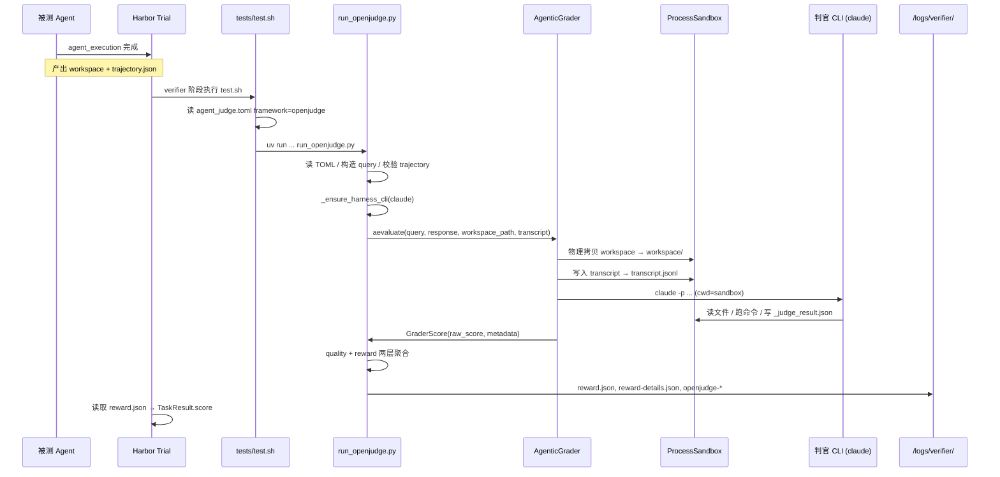

# PawBench OpenJudge 评测 Pipeline 说明

本文档描述 PawBench Harbor-v2 后端如何调用 OpenJudge 对 agent 产出进行判分，以及 OpenJudge 各入参（`query`、`response`、`rubrics`、`workspace_path`、`transcript` 等）是如何构造的。

适用版本：

- PawBench adapter：`pawbench/harbor_v2/verifier/run_openjudge.py`
- OpenJudge 包：`py-openjudge @ git+https://github.com/agentscope-ai/OpenJudge.git@094298f9b19fcf426add9474ad4c3ef20c36d1d1`
- 示例 task：`data/data_v2.1/ws-calculation-chain-2029`

---

## 1. 总览

OpenJudge 在 PawBench 中不是「单次 LLM HTTP 调用」，而是 **agent-as-judge**：

1. PawBench 读取 task 的 `agent_judge.toml`，构造 rubrics 与 query 上下文；
2. 调用 OpenJudge 的 `AgenticGrader`；
3. `AgenticGrader` 在临时 sandbox 中物理拷贝 workspace + trajectory；
4. 启动外部 coding-agent CLI（默认 `claude`，即 Claude Code）作为判官；
5. 判官在 sandbox 内读文件、跑命令、写 `_judge_result.json`；
6. PawBench 读取结果文件，做两层分数聚合，写出 `reward.json`。

与 RewardKit 的主要差异：

| 维度 | OpenJudge | RewardKit |
|------|-----------|-----------|
| 隔离方式 | `ProcessSandbox` 物理拷贝到 `/tmp/openjudge_harness_*` | `fuse-overlayfs` overlay 挂载 |
| 判分主体 | 外部 CLI agent（claude/codex/cursor） | RewardKit grader + code layer |
| Code layer | **不走** `ua_task_score.py` | 会跑 format/result/process 等 |
| 稳定性（shared Docker 环境） | 较稳定，无 overlay 依赖 | 易出现 `fuse-overlayfs` 失败导致 0 分 |

---

## 2. 如何启用 OpenJudge

在 task 的 `tests/quality/agent_judge.toml` 中设置：

```toml
[judge]
framework = "openjudge"
judge = "claude-code"          # 判官 harness：claude-code / codex / cursor-agent
model = "deepseek-v4-pro"      # TOML 默认模型（可被 env 覆盖，见 §6.4）
timeout = 900
prompt_template = "agent_judge_prompt.md"
reference = "expected_behavior.txt"
```

PawBench backend 在 trial 启动前会检测 `framework`：

- 若为 `openjudge`：复制 task 到 runtime 目录，注入 centralized verifier（见 §3）；
- 否则：使用 task 自带的 `tests/test.sh`（通常为 RewardKit）。

推荐 task 配置：

```toml
[verifier]
environment_mode = "shared"
```

`shared` 表示 verifier 与 agent **运行在同一 Docker 容器**，可直接访问：

- `/home/node/workspace`（agent 工作区）
- `/logs/agent/trajectory.json`（ATIF 轨迹）

---

## 3. Trial 启动：Runtime Task 注入

源码：`pawbench/harbor_v2/verifier/__init__.py` → `materialize_openjudge_task()`

当 `uses_openjudge(task_dir)` 为真时，`backend.py` 会：

1. 将原始 task **完整复制**到 `trials/.pawbench-runtime-tasks/<trial_name>-openjudge/`；
2. 注入以下文件（**不修改 dataset 源目录**）：
   - `tests/quality/run_openjudge.py`
   - `tests/quality/input_contract.py`
   - `tests/test.sh`（替换为 centralized dispatcher）
3. 写入 `tests/quality/pawbench-provenance.json`（task/judge/adapter 的 sha256 + run 元数据）。

原始 task 里的 `tests/test.sh`（RewardKit 版）不会被改动；实际 trial 使用的是 runtime 副本中的 dispatcher。

---

## 4. 完整 Pipeline 时序



---

## 5. Verifier 入口：`tests/test.sh`

注入后的 dispatcher（`pawbench/harbor_v2/verifier/test.sh`）：

```bash
case "${FRAMEWORK:-rewardkit}" in
  openjudge)
    uv run \
      --with "py-openjudge @ git+https://github.com/agentscope-ai/OpenJudge.git@094298f9..." \
      --with "tomli>=2.0.0" \
      python /tests/quality/run_openjudge.py
    ;;
  *)
    uvx rewardkit /tests --workspace /home/node/workspace
    ;;
esac

test -f /logs/verifier/reward.json
```

要点：

- OpenJudge 包在 **verifier 阶段** 由 `uv run --with` 临时拉取，不 bake 进 task 镜像；
- 必须产出 `/logs/verifier/reward.json`，否则 Harbor 认为 verifier 失败；
- 首次运行会有 uv 拉包开销（约数秒～数十秒），后续可能有缓存。

---

## 6. `run_openjudge.py`：入参构造详解

### 6.1 配置来源

| 路径 | 作用 |
|------|------|
| `/tests/quality/agent_judge.toml` | judge harness、criteria、scoring |
| `/tests/quality/agent_judge_prompt.md` | query 的任务说明前缀（由 `prompt_template` 指定） |
| `/tests/quality/expected_behavior.txt` | golden reference（由 `reference` 指定） |
| `/tests/reward.toml` | 最终 `reward` 字段的二次聚合 |
| `/home/node/workspace` | agent 工作区（`OPENJUDGE_WORKSPACE` 可覆盖） |
| `/logs/agent/trajectory.json` | ATIF 轨迹（`OPENJUDGE_TRAJECTORY` 可覆盖） |

### 6.2 `query` 的构造（`_load_context()`）

`query` 是传给 `AgenticGrader.aevaluate(query=...)` 的**任务上下文**，由三段拼接：

```
query = prompt_prefix + checkpoint_policy + ground_truth_reference
```

#### 段 1：`prompt_template` 的前缀

```python
prompt = read("agent_judge_prompt.md")
prompt = prompt.partition("## Criteria")[0].rstrip()
```

**只保留 `## Criteria` 之前的内容**。原因：RewardKit 版模板自带 criteria 列表和 stdout JSON 协议，OpenJudge 会在下一层重新注入 rubrics 和 output schema，因此这里主动截断避免重复/冲突。

示例（`ws-calculation-chain-2029`）保留的部分：

```markdown
You are an evidence-based agent judge for a PawBench Workspace task.

## Your job
- Read the candidate deliverables and, when needed, open binary/text sources in the workspace.
- For process criteria, you MUST cite concrete steps from the ATIF trajectory.
...
```

#### 段 2：PawBench 硬编码的 Checkpoint 评估策略

```python
"## Checkpoint evaluation policy\n"
"- Evaluate every checkpoint independently...\n"
"- Apply only the requirements explicitly stated in that checkpoint...\n"
"- Distinguish requirements for different deliverables...\n"
"- Cite the candidate artifact and source evidence..."
```

这段与具体 task 无关，所有 OpenJudge task 共用。

#### 段 3：`reference` 文件全文

```python
"## Ground-truth reference\n"
"Use this reference as expected behavior, but verify the candidate "
"against concrete files in the copied workspace.\n"
+ expected_behavior.txt 全文
```

`expected_behavior.txt` 用自然语言描述 golden 事实（如哪些文件是权威源、正确数值、deliverable 路径等）。判官通过这段理解 workspace 中各文件的**语义角色**——没有结构化 manifest，全靠文本描述。

#### 最终拼接

```python
return "\n\n".join(part for part in parts if part)
```

### 6.3 `response` 的构造

固定字符串，不是 agent 的文字回复：

```python
response = (
    "The candidate's submitted artifacts and all task source files are "
    "available under ./workspace in the judge sandbox."
)
```

workspace 类 task 评的是文件产出，不是对话回复，因此用这句话提示判官证据位置。

### 6.4 `rubrics` 的构造（`_build_rubrics()`）

从 `agent_judge.toml` 的每个 `[[criterion]]` 生成一个 OpenJudge `Rubric`：

```python
Rubric(
    name=criterion["name"],
    description=criterion["description"],
    weight=criterion["weight"],
    checkpoints=[
        Checkpoint(id=criterion["id"], description=criterion["description"], weight=1.0)
    ],
)
```

每个 criterion → 1 个 rubric → 1 个 checkpoint（id 即 criterion id）。

`ws-calculation-chain-2029` 示例：

| id | weight | 类型 |
|----|--------|------|
| source_identification | 2.0 | process（看 trajectory） |
| avoid_stale_or_misleading_source | 1.5 | process |
| deliverable_golden_alignment | 2.0 | result（看 deliverable + golden） |
| no_shortcut | 1.5 | process |

总 weight = 7.0。

### 6.5 `workspace_path`

```python
WORKSPACE_PATH = Path(os.environ.get("OPENJUDGE_WORKSPACE", "/home/node/workspace"))
```

传给 `aevaluate(workspace_path=str(WORKSPACE_PATH))`，由 `ProcessSandbox` 物理拷贝到 sandbox 的 `./workspace/`。

**注意**：`agent_judge.toml` 中的 `[judge].files` 列表**当前未被 `run_openjudge.py` 读取**，是 RewardKit 遗留字段。OpenJudge 路径会拷贝整个 workspace，不限定 files。

### 6.6 `transcript`（trajectory）

```python
TRAJECTORY_PATH = Path(os.environ.get("OPENJUDGE_TRAJECTORY", "/logs/agent/trajectory.json"))

def _load_trajectory() -> list[dict]:
    payload = validate_atif(json.loads(read(TRAJECTORY_PATH)))
    metadata = {"type": "atif_metadata", "schema_version": ..., "session_id": ..., "agent": ...}
    return [metadata, *payload["steps"]]
```

流程：

1. 从 `/logs/agent/trajectory.json` 读取 ATIF JSON；
2. 经 `input_contract.validate_atif()` 校验（schema_version、session_id、agent.name/version、steps 等）；
3. 转为 list（metadata + steps），传给 `aevaluate(transcript=trajectory)`；
4. `ProcessSandbox` 将其写成 sandbox 内的 `transcript.jsonl`（一行一个 JSON）。

**路径不一致问题（已知）**：criterion description 中常写 `/logs/agent/trajectory.json`，但 sandbox 内实际文件是 `./transcript.jsonl`。判官需自行 find/read；若模型不够 agentic 可能误判 "trajectory missing"。建议 criterion 文案改为引用 `transcript.jsonl`。

`agent_judge.toml` 中的 `atif-trajectory` 字段同样**未被 adapter 读取**，实际路径由 `TRAJECTORY_PATH` 常量/env 决定。

### 6.7 判官 Harness 与 Model（`_resolve_harness()`）

#### Harness 选择

```python
harness_name = (
    os.environ.get("OPENJUDGE_HARNESS")
    or judge.get("judge", "claude-code")
    or os.environ.get("REWARDKIT_JUDGE")
)
HARNESS_TYPES = {
    "claude": ClaudeCodeHarness,
    "claude-code": ClaudeCodeHarness,
    "codex": CodexHarness,
    "cursor": CursorAgentHarness,
    "cursor-agent": CursorAgentHarness,
}
```

#### Model 优先级

```python
model = (
    os.environ.get("OPENJUDGE_MODEL")
    or os.environ.get("JUDGE_MODEL")
    or os.environ.get("MODEL")
    or judge.get("model")                    # TOML 默认值，优先级较低
    or os.environ.get("REWARDKIT_MODEL")
)
model = _strip_model_prefix(model)  # openai/qwen3.7-max → qwen3.7-max
```

**实际生效模型通常来自 `run_bench.py --judge`**，backend 注入 `JUDGE_MODEL` / `OPENJUDGE_MODEL`，会覆盖 TOML 里的 `model = "deepseek-v4-pro"`。

#### CLI 安装与凭证

`_ensure_harness_cli()`：若 sandbox 内无 `claude`，尝试 bootstrap 或 npm 安装。预装 claude-code 到 task 镜像可跳过 ~50s 安装。

`_configure_cli_environment()`：将 PawBench judge 凭证映射到 Claude Code env：

- `ANTHROPIC_API_KEY` ← `JUDGE_API_KEY`
- `ANTHROPIC_BASE_URL` ← `JUDGE_BASE_URL`（去掉 `/v1` 后缀）
- `ANTHROPIC_MODEL` ← judge model
- `IS_SANDBOX=1`（root 下 bypassPermissions 需要）

---

## 7. OpenJudge 内部：最终 Prompt 拼装

PawBench 的 `query` 只是中间产物。`AgenticGrader._build_prompt()` 会再包一层框架级指令：

```
[系统指令: sandbox 边界 + 证据位置 + 输出协议]
<query>{_load_context() 的产物}</query>
<response>{固定 workspace 提示}</response>

## Rubric: source_identification (weight=2.0)
[criterion description]
- [source_identification] (weight=1.0) [同 description]

## Rubric: avoid_stale_or_misleading_source (weight=1.5)
...

## Rubric: deliverable_golden_alignment (weight=2.0)
...

## Rubric: no_shortcut (weight=1.5)
...
```

完整字符串写入 sandbox 的 `_judge_spec.json` 的 `instructions` 字段，并作为 `claude -p "<prompt>"` 的参数。

### Sandbox 目录结构

```
/tmp/openjudge_harness_XXXXXX/
├── workspace/              # /home/node/workspace 的物理拷贝
├── transcript.jsonl        # ATIF trajectory（一行一条 JSON）
├── _judge_spec.json        # { instructions, output_schema }
└── _judge_result.json      # 判官写入的 verdict（唯一可信来源）
```

### 判官 CLI 命令

```bash
claude -p "<完整 prompt>" \
  --output-format stream-json \
  --verbose \
  --permission-mode bypassPermissions \
  --model <judge_model>
```

cwd = sandbox 目录。判官可读 `./workspace/`、`./transcript.jsonl`，写 `./_judge_result.json`。

### 判官输出格式

```json
{
  "source_identification": {
    "passed": true,
    "reason": "...",
    "execution_log": "..."   // 可选
  },
  "avoid_stale_or_misleading_source": { "passed": true, "reason": "..." },
  "deliverable_golden_alignment": { "passed": false, "reason": "..." },
  "no_shortcut": { "passed": true, "reason": "..." }
}
```

OpenJudge **不解析** Claude Code 的 stdout JSON schema，只读 `_judge_result.json`。若文件缺失，`RecordingHarness` 会尝试从 stream-json 恢复（见 §9）。

---

## 8. 分数聚合

### 8.1 OpenJudge 内部 `raw_score`

每个 rubric 只有 1 个 checkpoint，rubric score = pass(1) / fail(0)。

```
raw_score = Σ(rubric.weight × rubric.score) / Σ(rubric.weight)
```

`ws-calculation-chain-2029`：4 个都 pass → raw_score = 1.0。

### 8.2 第一层：`agent_judge.toml [scoring]`

```python
quality_score = _aggregate(raw_score, passed_values, scoring_aggregation, scoring_threshold)
```

| aggregation | 行为 |
|-------------|------|
| `weighted_mean` | 直接返回 raw_score（连续分） |
| `threshold` | raw_score >= threshold → 1.0，否则 0.0 |
| `all_pass` | 所有 criterion passed → 1.0，否则 0.0 |
| `any_pass` | 任一 passed → 1.0，否则 0.0 |

### 8.3 第二层：`tests/reward.toml`

```toml
[[reward]]
name = "reward"
aggregation = "threshold"
threshold = 0.7
```

```python
reward_score = 1.0 if quality_score >= 0.7 else 0.0
```

示例：claude-code 某次 quality=0.714（3/4 criterion pass），reward 仍为 1.0（>= 0.7）。

### 8.4 输出文件

| 文件 | 内容 |
|------|------|
| `/logs/verifier/reward.json` | `{"quality": float, "reward": float}` |
| `/logs/verifier/reward-details.json` | 每条 criterion 的 passed/reasoning/weight |
| `/logs/verifier/openjudge-harness.json` | CLI 元数据：duration、exit_code、model |
| `/logs/verifier/openjudge-judge-spec.json` | 完整 prompt + output_schema |
| `/logs/verifier/openjudge-judge-result.json` | `_judge_result.json` 拷贝 |
| `/logs/verifier/openjudge-judge-stream.jsonl` | 判官 stream-json 完整输出 |
| `/logs/verifier/openjudge-judge/run-001/*` | stdout、stderr、spec、result |
| `/logs/verifier/openjudge-input-readiness.json` | trajectory 校验结果 |
| `/logs/verifier/openjudge-provenance.json` | run provenance |

Trial 结束后，上述文件位于：

```
results/<experiment>/.../trials/<trial_name>/verifier/
```

---

## 9. 失败处理与容错

任何异常时，`run_openjudge.py` **仍会写出**：

```json
{"quality": 0.0, "reward": 0.0}
```

避免 Harbor 因缺 `reward.json` 报 `RewardFileNotFoundError` 而掩盖真实错误。需查看 `openjudge-harness.json` 或 stderr 区分基础设施失败 vs agent 真做得差。

| 失败类型 | 表现 |
|----------|------|
| trajectory 缺失/非 ATIF | `input-readiness.json` ready=false |
| claude CLI 缺失且安装失败 | RuntimeError in runner_error |
| 判官超时（默认 900s） | harness timed_out=true |
| 未写 `_judge_result.json` | 尝试 stream-json 恢复；失败则 0 分 |
| 判官幻觉 | 不 crash，但 reasoning 可能错误（无 k-sample 校验） |

---

## 10. 环境变量参考

### PawBench backend 注入（`_build_verifier_env()`）

| 变量 | 来源 | 用途 |
|------|------|------|
| `JUDGE_MODEL` | `--judge` 参数 | 判官 LLM 模型 id |
| `JUDGE_API_KEY` | judge api key | API 认证 |
| `JUDGE_BASE_URL` | judge base url | API 端点 |
| `OPENJUDGE_MODEL` | 同 JUDGE_MODEL | OpenJudge 专用 |
| `ANTHROPIC_API_KEY` | 转发 judge key | Claude Code CLI |
| `ANTHROPIC_BASE_URL` | 转发 judge url | Claude Code CLI |

### `run_openjudge.py` 可覆盖

| 变量 | 默认 | 说明 |
|------|------|------|
| `OPENJUDGE_WORKSPACE` | `/home/node/workspace` | workspace 路径 |
| `OPENJUDGE_TRAJECTORY` | `/logs/agent/trajectory.json` | ATIF 轨迹路径 |
| `OPENJUDGE_HARNESS` | TOML `judge` | 判官 CLI 类型 |
| `OPENJUDGE_TIMEOUT` | TOML `timeout` 或 900 | 判官超时秒数 |
| `OPENJUDGE_JUDGE_LOG_DIR` | `/logs/verifier/openjudge-judge` | 判官日志目录 |

---

## 11. `agent_judge.toml` 字段生效情况

| 字段 | 是否被 OpenJudge adapter 读取 | 说明 |
|------|------------------------------|------|
| `framework` | ✅ | 必须为 `openjudge` |
| `judge` | ✅ | 判官 harness |
| `model` | ✅（低优先级） | 常被 env 覆盖 |
| `timeout` | ✅ | 判官超时 |
| `prompt_template` | ✅ | query 前缀模板 |
| `reference` | ✅ | golden 参考文件 |
| `[[criterion]]` | ✅ | rubrics |
| `[scoring]` | ✅ | quality 聚合 |
| `files` | ❌ | RewardKit 遗留，未使用 |
| `isolated` | ❌ | RewardKit 遗留，未使用 |
| `atif-trajectory` | ❌ | 实际用 `OPENJUDGE_TRAJECTORY` env |

---

## 12. 示例：`ws-calculation-chain-2029` 实测

### 配置摘要

- `environment_mode = "shared"`
- 4 个 binary criteria，总 weight 7.0
- `[scoring] aggregation = "weighted_mean"`
- `[reward] threshold = 0.7`

### 最近一次 OpenJudge 跑分（预装镜像）

| Agent | quality | reward | 判官耗时 | 备注 |
|-------|---------|--------|----------|------|
| openclaw | 1.0 | 1.0 | 146s | 4/4 pass |
| hermes | 1.0 | 1.0 | 78s | 4/4 pass |
| qwenpaw | 1.0 | 1.0 | 89s | 4/4 pass |
| claude-code | 0.71 | 1.0 | 133s | `deliverable_golden_alignment` fail：summary 总额抄错 |
| codex | 1.0 | 1.0 | 107s | 4/4 pass |

结果目录：`results/ws-calc-2029-preinstalled-openjudge-{agent}/`

---

## 13. 已知局限与改进建议

1. **trajectory 路径文案不一致**：criterion 写 `/logs/agent/trajectory.json`，sandbox 实际是 `transcript.jsonl` → 建议统一文案或在 sandbox 内创建 symlink。
2. **`files` / `isolated` 死配置**：易误导维护者，建议在文档或代码中显式废弃或实现。
3. **模型优先级隐蔽**：TOML model 常被 env 静默覆盖 → 建议在 `openjudge-harness.json` 记录 effective model 及来源。
4. **单次采样无一致性校验**：判官幻觉无法自检 → 可考虑 k-sample + 投票。
5. **失败统一 0 分**：基础设施问题与 agent 质量问题在 score 上不可区分 → 需查 harness 日志。
6. **sandbox 非安全边界**：判官可 `bypassPermissions` 执行任意命令，恶意 workspace 有风险。

---

## 14. 相关源码路径

```
pawbench/harbor_v2/
├── backend.py                    # materialize_openjudge_task 触发、verifier env 注入
└── verifier/
    ├── __init__.py               # uses_openjudge, materialize_openjudge_task
    ├── test.sh                   # framework dispatcher
    ├── run_openjudge.py          # 主 runner：入参构造、聚合、写 reward
    ├── input_contract.py         # ATIF trajectory 校验
    └── OPENJUDGE_PIPELINE.md     # 本文档

OpenJudge (git pin 094298f9...)
├── openjudge/graders/agentic_grader.py   # AgenticGrader, _build_prompt
├── openjudge/harness/sandbox.py          # ProcessSandbox
├── openjudge/harness/base.py             # BaseHarness.run, 文件协议
└── openjudge/harness/claude_code.py      # ClaudeCodeHarness
```

---

## 15. 快速调试命令

```bash
# 查看某次 trial 的判官元数据
cat results/.../trials/.../verifier/openjudge-harness.json

# 查看 4 条 criterion 详细理由
cat results/.../trials/.../verifier/reward-details.json | jq '.quality.criteria'

# 查看判官原始 verdict
cat results/.../trials/.../verifier/openjudge-judge-result.json

# 查看判官完整执行流（工具调用、读文件）
cat results/.../trials/.../verifier/openjudge-judge/run-001/stdout.jsonl

# 查看发给判官的完整 prompt
cat results/.../trials/.../verifier/openjudge-judge-spec.json | jq -r '.instructions' | head -80
```
